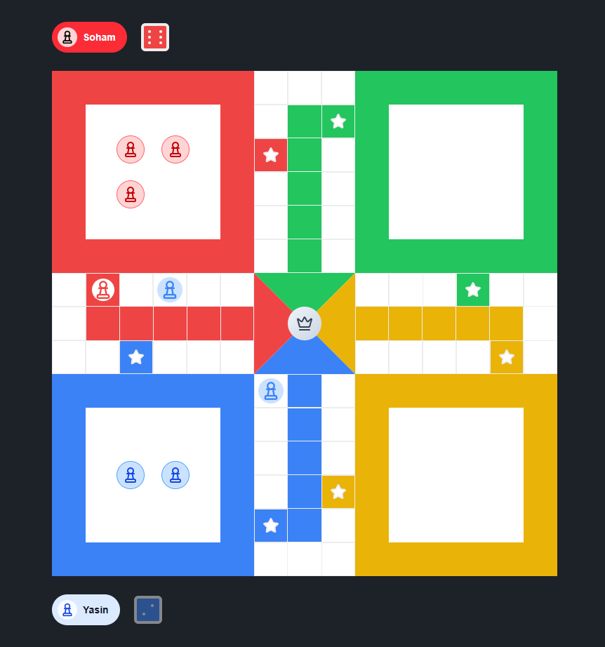

# Ludo Multiplayer

A minimal real-time multiplayer Ludo game built with **Next.js** and **Go**.

## Features

- 🎮 Real-time multiplayer gameplay
- 🔌 Built-in WebSocket support
- 👥 Multiple player views
- ⚡ Fast backend written in Go
- 💻 Modern frontend with Next.js

## Tech Stack

- Frontend: Next.js
- Backend: Go (Golang)
- Communication: WebSockets

## Project Structure

```
/frontend   # Next.js app
/backend    # Go WebSocket server
```

## Screenshot

