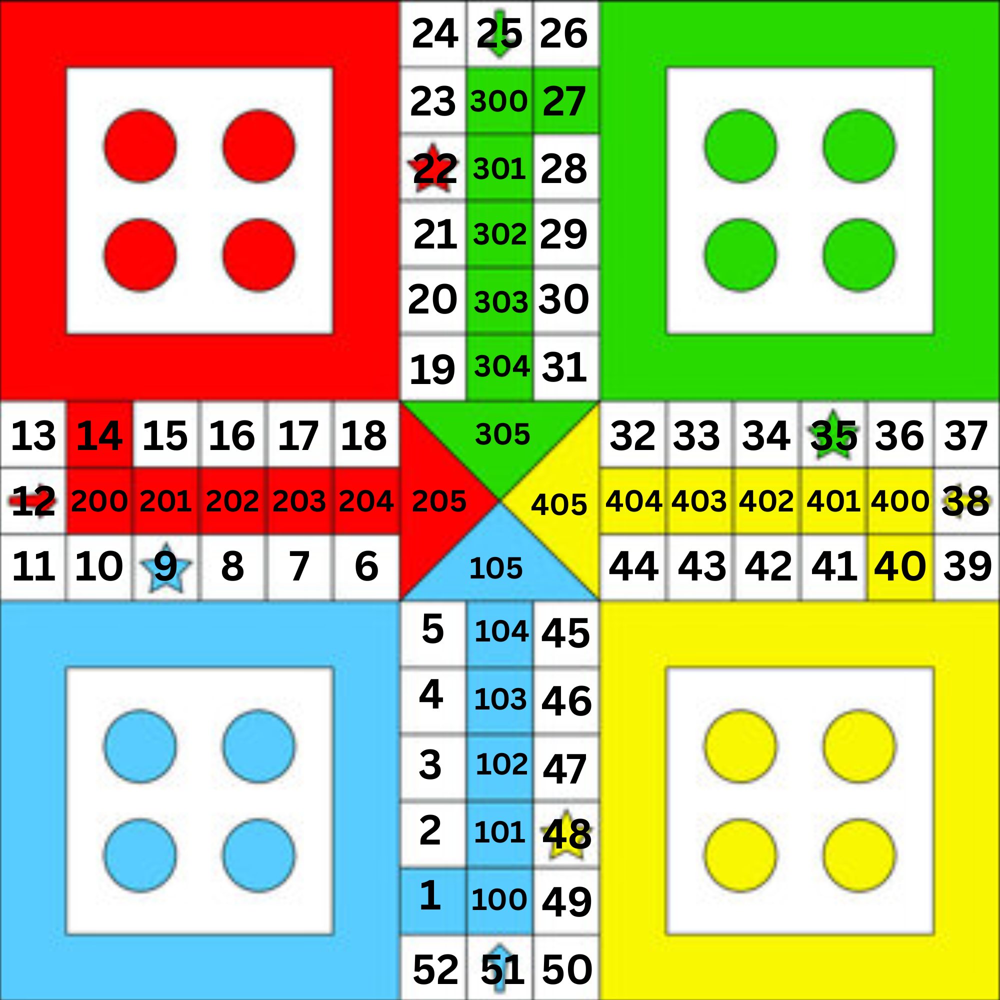

# Ludo Board & Game State Logic

## 1. Board Cell IDs

Every playable cell on the Ludo board has a **unique ID**.

For example:

```text
1 → First board cell
2 → Second board cell
3 → Third board cell
...
52 → Last common board cell

100-104 → Blue home path
200-204 → Red home path
300-304 → Green home path
400-404 → Yellow home path
```

The home paths are unique for every color, so a blue piece can never collide with a red piece inside the home stretch.

## 

# 2. Player Movement Maps

Each color has its own movement path.

Instead of storing the board cell directly, the game stores the **index** inside that color's movement array.

Example movement map:

```json
{
	"blue": [1, 2, 3, 4, 5, "...", 51, 100, 101, 102, 103, 104],
	"red": [
		14,
		15,
		16,
		17,
		"...",
		52,
		1,
		2,
		3,
		"...",
		12,
		200,
		201,
		202,
		203,
		204
	]
}
```

Notice that:

- Blue starts at board cell **1**
- Red starts at board cell **14**
- Green starts at board cell **27**
- Yellow starts at board cell **40**

Although every player starts at a different board cell, they all eventually travel around the same board.

---

# 3. Why Store the Position as an Index?

Instead of storing the current board cell, each piece stores the **index** of its movement path.

Example:

```json
{
	"blue": {
		"position": 3
	}
}
```

This **does not mean** the piece is on board cell **3**.

It means:

```go
moves["blue"][3]
```

which returns

```text
4
```

So the piece is actually standing on **board cell 4**.

Another example:

```json
{
	"red": {
		"position": 0
	}
}
```

means

```go
moves["red"][0]
```

returns

```text
14
```

So the red piece is on board cell **14**.

Storing indexes makes movement very easy.

Moving a piece by 6 simply becomes:

```go
piece.Position += 6
```

instead of calculating board cells manually.

---

# 4. Converting an Index to a Board Cell

Whenever the game needs to know the actual board location of a piece, it converts the index using the movement map.

Example:

```go
boardPos := moves[color][piece.Position]
```

Examples:

```text
Blue index 0  -> Cell 1
Blue index 8  -> Cell 9

Red index 0   -> Cell 14
Red index 38  -> Cell 52
Red index 39  -> Cell 1
```

This conversion is used for:

- Detecting collisions
- Kill logic
- Safe position checks
- Rendering pieces on the board

---

# 5. Safe Positions

Some board cells are marked as safe.

```go
safePositions = {
    1,
    9,
    14,
    22,
    27,
    35,
    40,
    48,
}
```

These are **board cell IDs**, **not indexes**.

If a piece is standing on one of these cells, it cannot be killed by another player.

Example:

Blue piece

```go
Position = 13
```

Actual board cell

```go
moves["blue"][13]
```

returns

```text
14
```

Since **14** is a safe position, the piece cannot be killed.

---

# 6. Room Structure

The server stores every active room inside a map.

Example:

```json
{
  "1226": {
    "...room data..."
  }
}
```

The key (`1226`) is the room ID.

The value contains the complete game state for that room.

---

# 7. Room Properties

Example:

```json
{
	"canJoin": true,
	"playerCount": 2,
	"currentTurn": "blue",
	"winner": null
}
```

---

# 8. Players Object

The `players` object stores every player currently in the room.

The player's color is used as the key.

Example:

```json
{
  "players": {
    "blue": {...},
    "red": {...}
  }
}
```

---

# 9. Player Object

Example:

```json
{
  "blue": {
    "name": "soham",
    "pieces": { ... }
  }
}
```

Each player stores:

- Player name
- All four game pieces

---

# 10. Pieces Object

Each player owns four pieces.

Example:

```json
{
	"pieces": {
		"1": {
			"positionIndex": 1,
			"isFinished": false
		}
	}
}
```

Each piece contains three properties.

### positionIndex

Stores the **index** inside the player's movement path.

Special value:

```text
-1
```

means the piece is still inside its home.

---

### isFinished

```text
true
```

The piece has successfully reached the final destination.

```text
false
```

The piece is still playing.

---

# 11. Positions & index

Suppose we have:

```json
{
	"blue": {
		"position": 5
	},
	"red": {
		"position": 44
	}
}
```

Actual board positions:

```go
moves["blue"][5] // 6

moves["red"][44] // 6
```

Although their stored indexes are completely different:

```text
Blue index = 5
Red index = 44
```

both pieces are standing on **board cell 6**.

This is how the game detects collisions and determines whether a piece should be sent back home.

# Socket Server

## Install Dependencies

```bash
go mod tidy
```

## Run Server

```bash
go run .
```

If someone clones the project, they only need:

```bash
go mod tidy
go run .
```
